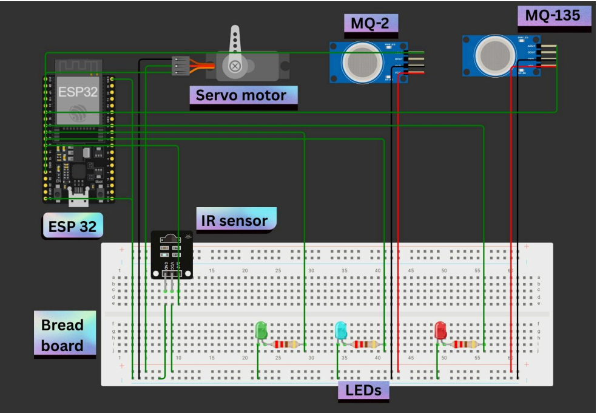
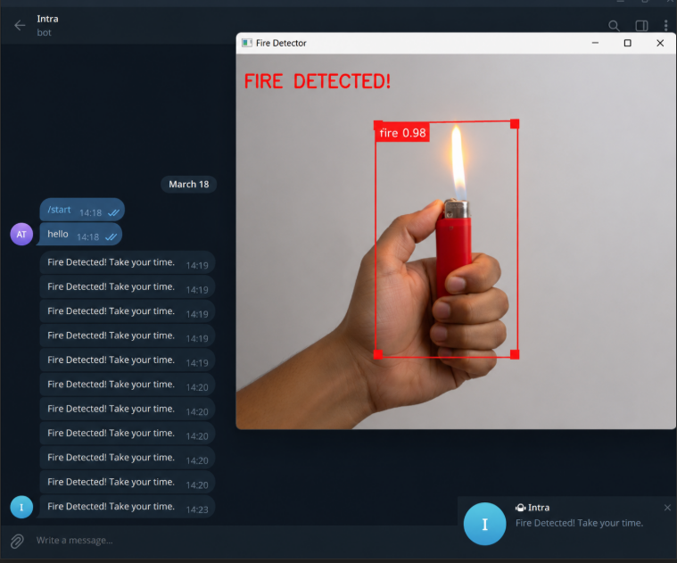

# 🔥 Autonomous Fire Detection and Suppression System

An intelligent fire detection and suppression system capable of identifying fire types using sensor fusion and automatically deploying the appropriate extinguishing response.

---

## 📌 Project Overview

Traditional fire suppression systems often deploy the same extinguishing agent regardless of the fire source, which can be ineffective or even dangerous. This project introduces an autonomous solution that detects, classifies, targets, and suppresses fires using ESP32-based control and multiple environmental sensors.

The system utilizes MQ-2, MQ-135, and IR flame sensors to analyze the surrounding environment, classify the fire type, and activate a servo-controlled suppression mechanism aimed directly at the source.

---

## ✨ Features

* Real-time fire detection
* Fire classification using sensor fusion
* Autonomous targeting mechanism
* ESP32-based control architecture
* Remote notification capability
* Scalable for industrial applications
* Reduced collateral damage through targeted suppression

---

## 🛠 Hardware Components

* ESP32 Development Board
* MQ-2 Gas Sensor
* MQ-135 Gas Sensor
* IR Flame Sensor
* Servo Motors
* LEDs
* Battery Supply System

---

## ⚙️ Working Principle

1. IR sensor detects an active flame.
2. MQ-2 and MQ-135 analyze gases and smoke.
3. ESP32 classifies the fire type.
4. Servo mechanism aligns toward the fire source.
5. Appropriate suppression action is triggered.
6. Notification and event logging are generated.

---

# 📸 Project Images

## CAD Model


---

## Circuit Diagram



---

## Notification System



---

## Prototype Circuit


---

## 📂 Repository Contents

```text
.
├── Images/
├── Documentation.pdf
├── Prototype Model.SLDPRT
└── README.md
```

---

## 🚀 Applications

* Smart Homes
* Data Centers
* Chemical Laboratories
* Industrial Facilities
* Commercial Kitchens

---

## 🔮 Future Scope

* Full 2-axis turret coverage
* Computer Vision integration (YOLOv8)
* ESP32-CAM support
* MQTT-based monitoring
* Wireless dashboard
* Multi-class fire detection

---

## 👥 Team Members

* Shubh Bagaria
* Ashutosh Tanguria
* Prithika Banerjee
* Nihal Jain
* Gargi Kolharkar
* Harshwardhan Narsude
